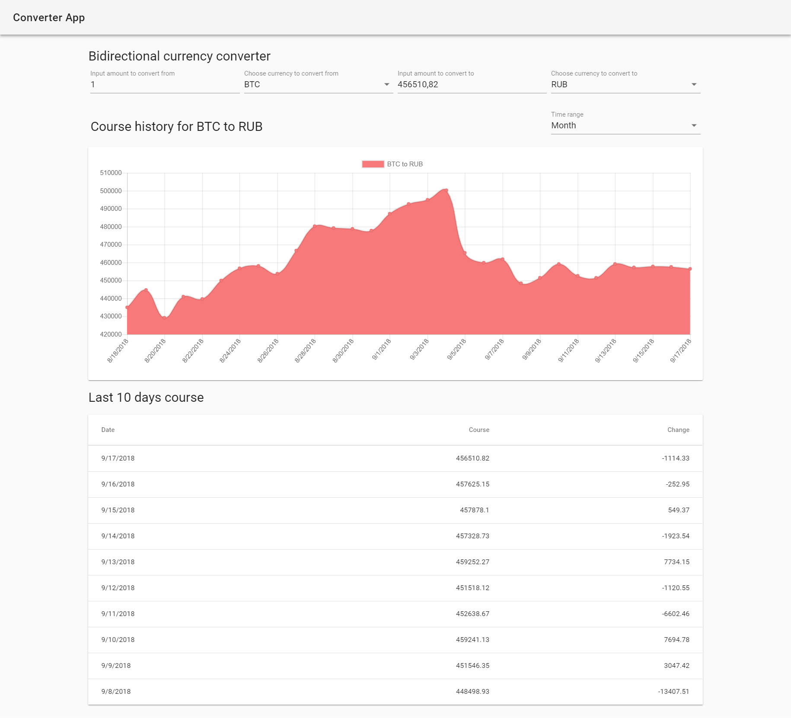

# Двусторонний конвертер валют



## Описание проекта

Приложение предоставляет возможности конвертации криптовалют в фиат и наоборот. Для этого нужно выбрать валюты в выпадающих списках. После чего вводя количество валюты в одно из полей, эквивалентное количество ей второй валюты по актуальному курсу будет показываться автоматически. Так же появляется график с историей курса, где можно выбрать длительность истории. Кроме того, можно увидеть изменение курса за последние 10 дней в виде таблицы.

## Описание применённых технологий

Приложение создано при помощи следующих библиотек:

1. **Vue**.
2. **Vuex** для хранения состояния приложения.
3. **Vuetify** для ускорения разработки графической части приложения.
4. **VueChartJS** для ускорения разработки возможности построения графика курса валют.

Кроме этого, были использованы следующие технологии

1. **Vue/CLI** для быстрой генерации каркаса приложения.
2. **TypeScript** и **vue-class-component** для статической типизации и работы с компонентами в виде классов.
3. **Jest** и **Cypress** для написание юнит и интеграционных тестов.
4. **SCSS** как CSS препроцессор, но из-за использования Vuetify стили практически не писались.
5. **Prettier** и **ESlint** в качестве линтера кода.

## Структура проекта

```
/src
    /components 
        /Chart.js - компонент отвечающий за генерацию графика курса валют.
    /logic
        /api.ts - вызовы методов API
        /classes.ts - содержит основные классы и константы
        /store-constants.ts - содержит константы для обозначения экшенов и мутаций во vuex
        /utils.ts - прочие утилиты
    /views
        /Converter.vue - страница с реализацией конвертера
    /App.vue - основной компонент приложения
    /router.ts - файл с роутингом приложения
    /store.ts - содержит store со стейтом, геттерами, мутациями, экшенами (тут содержится основная бизнес логика)
/tests
    /e2e
        /specs/test.js - интеграционные тесты
    /unit
        /converter.spec.ts - unit тесты
```

## Известные баги

* Не работает сборка проекта для продакшена (сборка для разработки работает).
* Не работают unit тесты под windows (возможно и на других платформах).


## Сборка и запуск проекта

### Установка зависимостей

```
npm install
```

### Сборка и запуск для разработки

```
npm run serve
```

### Сборка и минификация для продакшена

```
npm run build
```

### Проверить код-стайл и исправить

```
npm run lint
```

### Запуск юнит тестов

```
npm run test:unit
```

### Запуск интеграционных тестов

```
npm run test:e2e
```
